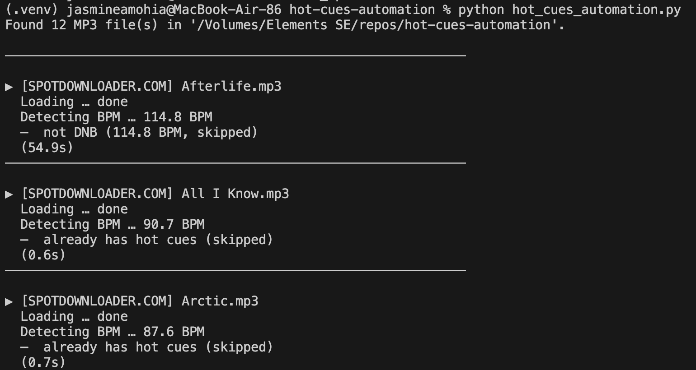
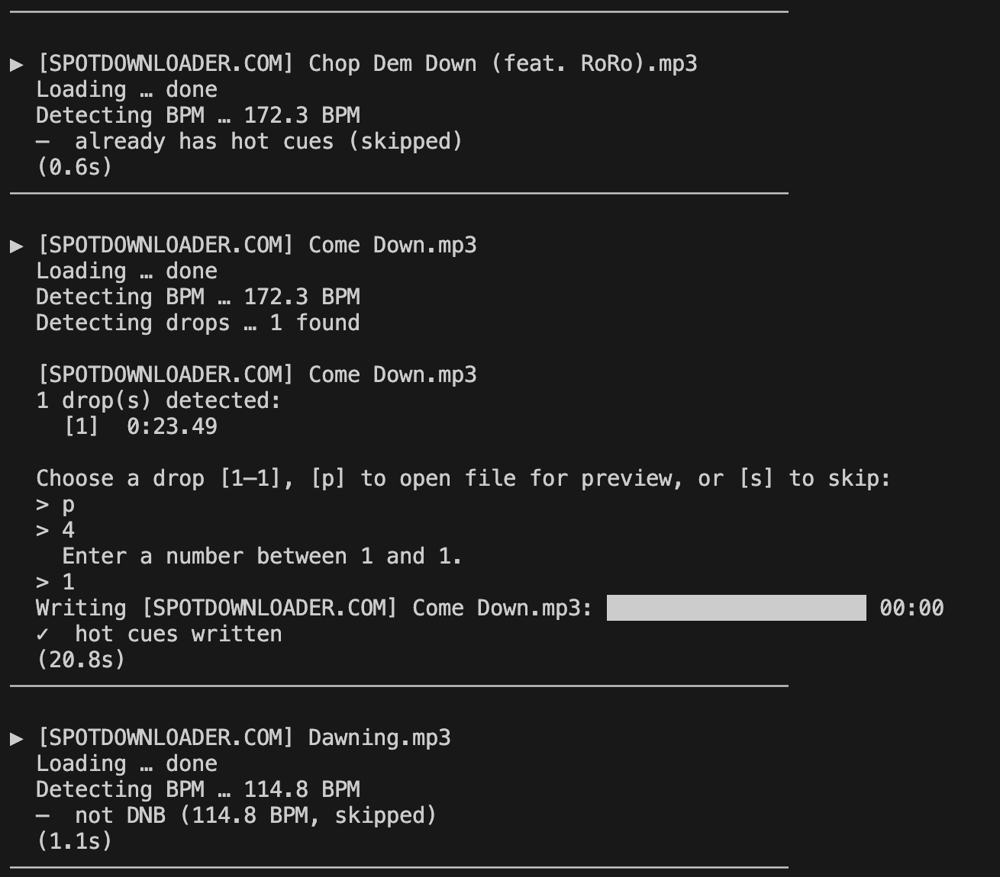
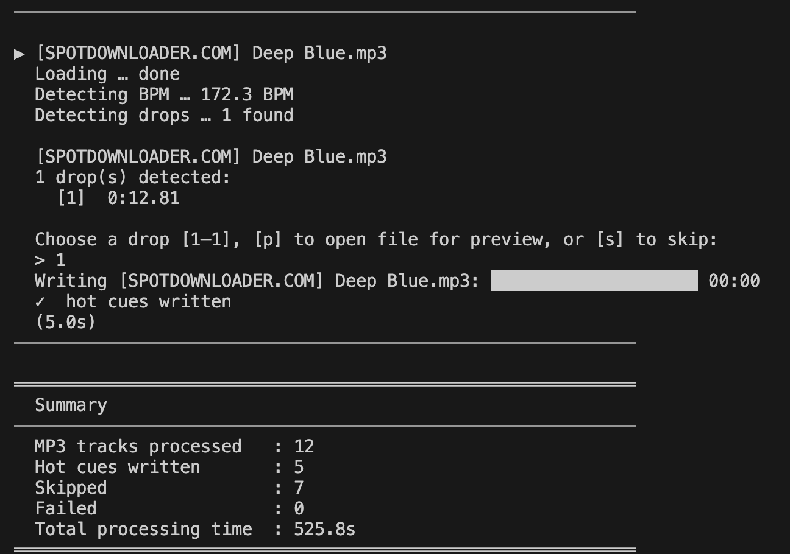

# hot-cues-automation

Adds Serato-compatible hot cues to drum-and-bass MP3 files.

The script scans one folder for `.mp3` files, detects DNB tempo tracks, skips
files that already contain Serato hot cues, asks which detected drop to use,
then writes three hot cues into the MP3's ID3 tags.

## Install as a command

Recommended, from this repo:

```bash
pipx install --editable .
```

That installs a command you can run from any folder:

```bash
hot-cues
```

If you do not have `pipx`, install it first:

```bash
python3 -m pip install --user pipx
python3 -m pipx ensurepath
```

Restart your terminal after `ensurepath` if `hot-cues` is not found.

## Development install

For local development from this repo:

```bash
python3 -m venv .venv
. .venv/bin/activate
pip install -e .
```

That installs the same command while the virtualenv is active:

```bash
hot-cues
```

## Usage

Run it from a folder that contains MP3s:

```bash
cd /path/to/serato-folder
hot-cues
```

Or pass the folder explicitly:

```bash
hot-cues /path/to/serato-folder
```

The scan is non-recursive. It only processes MP3 files directly inside the
selected folder.

## Notes

- The script writes ID3 tags directly into MP3 files, so test on copies first.
- During processing, enter a drop number to write cues, `p` to preview the file
  in the system audio player, or `s` to skip the track.
- Files that already have Serato hot cues are skipped.
script to automate process of adding hot cues in dnb tracks... hopefully. based off of my brother eyes method of the following hot cues:
1. first downbeat of a track
2. 16 bars before chosen drop
3. 8 bars before chosen drop

## to-do
- [x] add safety-net
- [ ] test serato compatibility
- [ ] test quality of hot cues

## local run
1. clone repo

2. set up virtual environment

```
python3 -m venv .venv
source .venv/bin/activate
pip install -r ./requirements.txt
```

3. nav to desired dir with script & run
```
cd whereever-your-heart-desires
# implement safety
python hot_cues_automation.py
```

## demo
starts by scanning mp3 files in dir

see diff handling:
- already has hot cues (skip)
- dnb without hot cues
  - choose a drop out of detected quantity w/ inp val
  - preview track as user might not remember drops
  - skip


exits with stats and summary



## copilot jumpstart
this was jumpstarted with copilot, prompt below:
> this script will be run within a directory.
mp3 files will be the only file formats inspected in directory.
>
>if dnb track is detected (174 bpm or 87bpm), AND if no hot cues are already set...
-> detect drops (n) in song
-> ask user in terminal if they want hot cues set up for 1, ..., n-1 drop in the song (also option to option mp3 file to listen to n-1 drops and decide)
-> processing begins: print terminal loading bar next to track name, log any errors. if err, don't write any hot cues for track
-> set 3 hot cues:
--> when the first down beat starts (usually near start of track, irrespective of n)
--> 16 4 beats before n drop
--> 8 4 beats before n drop
-> add comment metadata that says: hot cues generated
-> processing finishes: terminal output process time, mp3 tracks processed, mp3 tracks written with hot cue, failed mp3 tracks
>
>this is intended to be used for mp3 directories opened by Serato DJ Lite. make sure metadata changes are Serato dj lite compatible
